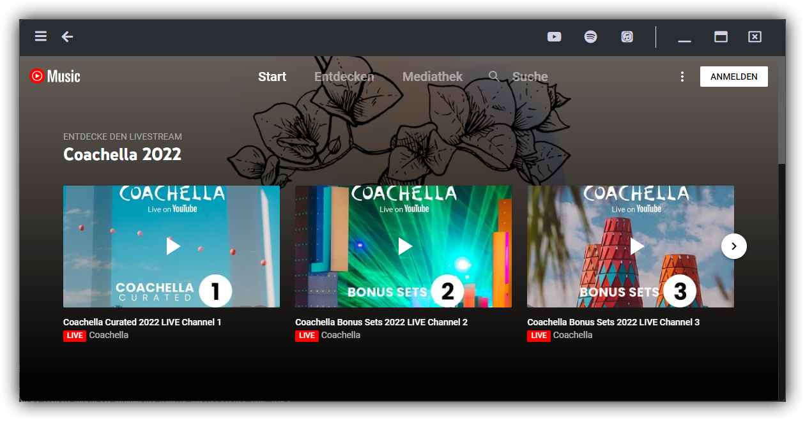

# musicclient
> Play music from your favorite streaming services. All in one place. 

Use one music client to play music from multiple streaming services. 




## Download

[Download for Windows](https://github.com/philliphqs/musicclient/releases/download/Stable/musicclient-setup-0.0.3.exe)

## Release History

* 0.0.3: Latest release.
    * Building the app for Windows.
    * Adding ``default_service``
    * Fixing Settings ``GoBack()`` 
* 0.0.2: Test release.
    * You can configure the client default service
    * Settings page
    * Fixed some bugs
* 0.0.1: Initial release.
    * Work in progress

## Building

Windows:
```bash
git clone https://github.com/philliphqs/musicclient.git
cd musicclient
npm i
yarn app:dist
```
## Meta

philliphqs – [@phillip_hqs](https://twitter.com/phillip_hqs) – philliphqs@protonmail.com

Distributed under the XYZ license. See ``LICENSE`` for more information.

[github.com/philliphqs/](https://github.com/philliphqs/)

## Contributing

1. Fork it (<https://github.com/philliphqs/musicclient/fork>)
2. Create your feature branch (`git checkout -b feature/fooBar`)
3. Commit your changes (`git commit -am 'Add some fooBar'`)
4. Push to the branch (`git push origin feature/fooBar`)
5. Create a new Pull Request


